# zbank Testnet Blockchain - Proof of Authority(POA)
    The Proof of Authority (PoA) algorithm is typically used for private blockchain networks as it requires pre-approval of, or voting in of, the account addresses that can approve transactions (seal blocks).

# Environment setup  

* **Create accounts for two nodes for the network with a separate datadir for each using geth**
    * ./geth --datadir zbanknode1 account new
    * ./geth --datadir zbanknode2 account new  
    
    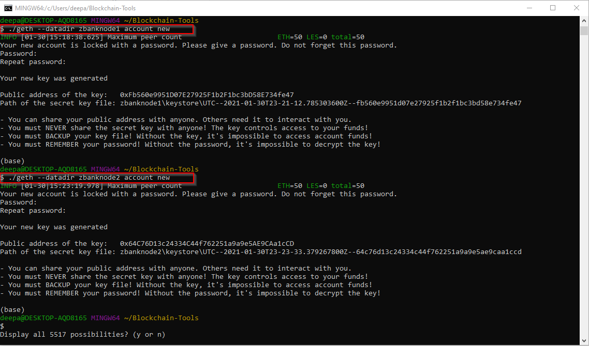

* **Generate Genesis block**

    * Run `puppeth`, name your network `zbank`, and select the option to configure a new genesis block.

    * Choose the `Clique (Proof of Authority)` consensus algorithm.

    * Paste both account addresses from the first step one at a time into the list of accounts to seal.

    * Paste them again in the list of accounts to pre-fund. There are no block rewards in PoA, so you'll need to pre-fund.

    * Choose `no` for pre-funding the pre-compiled accounts (0x1 .. 0xff) with wei. This keeps the genesis cleaner.

    * Complete the rest of the prompts, and when you are back at the main menu, choose the "Manage existing genesis" option.

        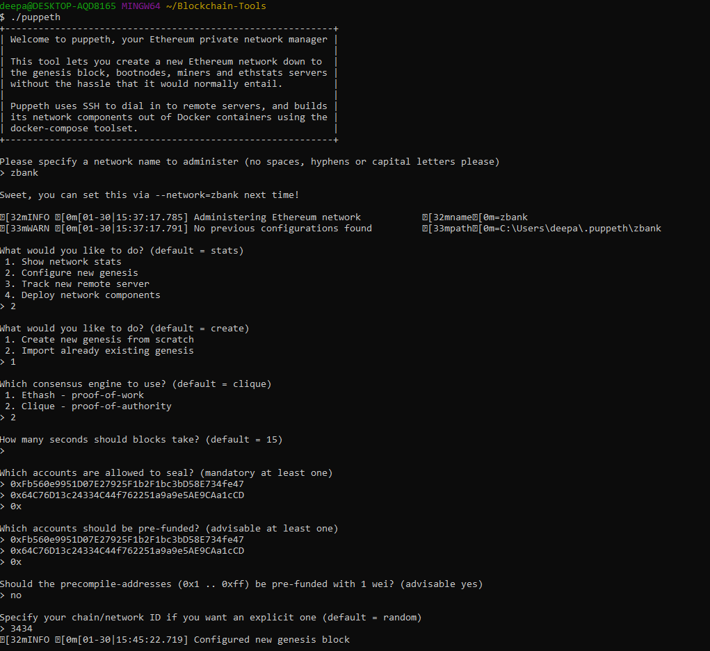

* **Export genesis configurations. This will fail to create two of the files, but you only need `zbank.json`**

    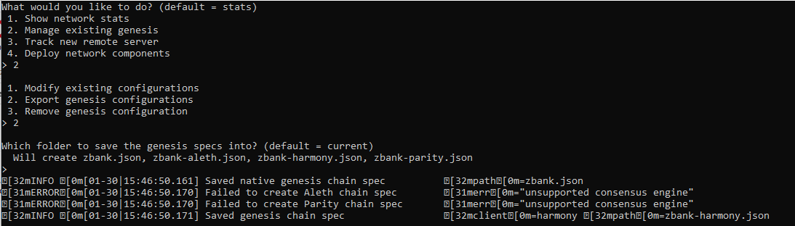

* **Initialize the nodes with the genesis json file**

    * Using `geth`, initialize each node with the new `zbank.json`
        * ./geth --datadir zbanknode1 init zbank.json
        * ./geth --datadir zbanknode2 init zbank.json

        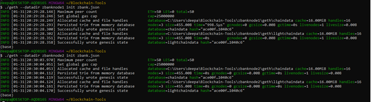  

# How to use testnet blockchain `zbank` to transfer crypto between two nodes

## Following nodes were created within the genesis block `zbank` with addresses
*   zbanknode1 (SEALER_ONE)
    *   Address: Fb560e9951D07E27925F1b2F1bc3bD58E734fe47
    *   Passwd: zbank21
*   zbanknode2 (SELAER_TWO)
    *   Address: 64C76D13c24334C44f762251a9a9e5AE9CAa1cCD
    *   Passwd: zbank21
*   These are linked together by chain id `3434`

## How to start mining blocks using the above information

##  Step 1
* Run the following geth command in one terminal window:
    * ./geth --datadir node1 --unlock "SEALER_ONE_ADDRESS" --mine --rpc --allow-insecure-unlock
    * ./geth --datadir zbanknode1 --unlock "Fb560e9951D07E27925F1b2F1bc3bD58E734fe47" --mine --rpc --allow-insecure-unlock
    
    * **NOTE:** Type your password and hit enter - even if you can't see it visually!
    
    * Get enode address from the logs above by scrolling up and searching for self=enode
        * self=enode://535346540290b9c1071f7babcc35432a60e5aa5eeb470e96f848fb1e0fe95866ded0743d04f1068403235243eae231c6145ca20f7a93ae497600529ece135823@127.0.0.1:30303   
        
    * The `--unlock` flag tells the node to ask for unlocking the node with a password during a transaction  
    * The `--mine` flag tells the node to mine new blocks.  
    * The `--rpc` flag enables us to talk to the other node, which will allow us to use MyCrypto to transact on our chain.
    * The `--allow-insecure-unlock` flag tells the node that it is okay to allow insecure unlock

## Step 2
* Run the following geth command in a different terminal window:
    * ./geth --datadir node2 --unlock "SEALER_TWO_ADDRESS" --mine --port 30304 --bootnodes "enode://SEALER_ONE_ENODE_ADDRESS@127.0.0.1:30303" --ipcdisable --allow-insecure-unlock

    * ./geth --datadir zbanknode2 --unlock "64C76D13c24334C44f762251a9a9e5AE9CAa1cCD" --mine --port 30304 --bootnodes "enode://535346540290b9c1071f7babcc35432a60e5aa5eeb470e96f848fb1e0fe95866ded0743d04f1068403235243eae231c6145ca20f7a93ae497600529ece135823@127.0.0.1:30303" --ipcdisable --allow-insecure-unlock

    * **NOTE:** Type your password and hit enter - even if you can't see it visually!  
    
    * The `--unlock` flag tells the node to ask for unlocking the node with a password during a transaction  
    * The `--mine` flag tells the node to mine new blocks.
    * Since the first node's sync port already took up `30303`, we need to change this one to `30304` using --port

    * The `--bootnodes` flag allows you to pass the network info needed to find other nodes in the blockchain. This will allow us to connect both of our nodes using enode address of another node.   

    * In Microsoft Windows, we need to add the flag `--ipcdisable` due to the way Windows spawns new IPC/Unix sockets doesn't allow for having multiple sockets running from `geth` at once. Since we are only using `RCP` we can safely disable the `IPC` sockets.  

    * The `--allow-insecure-unlock` flag tells the node that it is okay to allow insecure unlock  
    
## Step 3
*   Validate your nodes are running in separate terminals

    *   Your testnet blockchain `zbank` is now running successfully with two nodes `zbanknode1` and `zbanknode1`. It should show the logs as shown below
    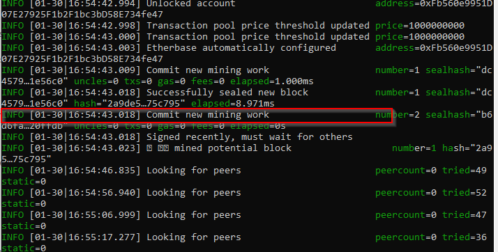
    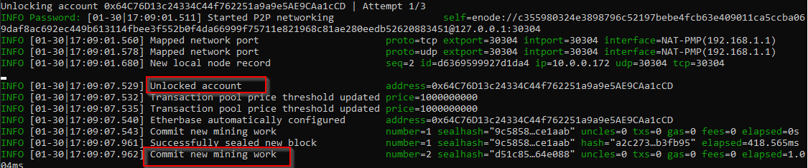

## Step 4
*   Add your blockchain nodes of `zbank` to MyCrypto for testing

    * Open the MyCrypto app, then click `Change Network` at the bottom left:

       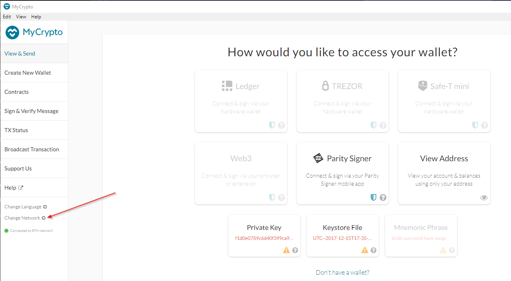

    * Select `Zbanknet` as your custom network:

        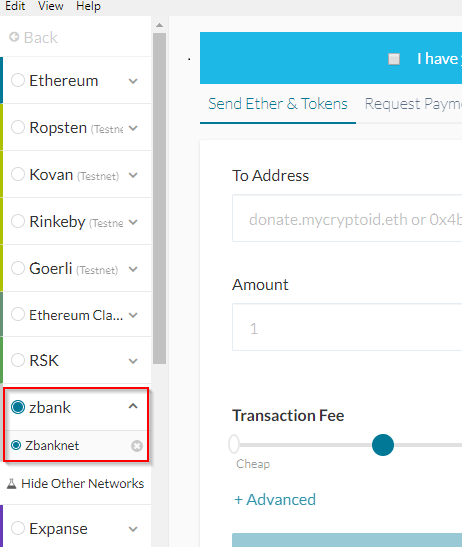
    
    * You have now connected MyCrypto to the `Zbanknet` custom network and can acesss its 2 nodes

## Step 5
*   Send money between accounts or nodes

    * Select the `View & Send` option from the left menu pane, then click `Keystore file`.

        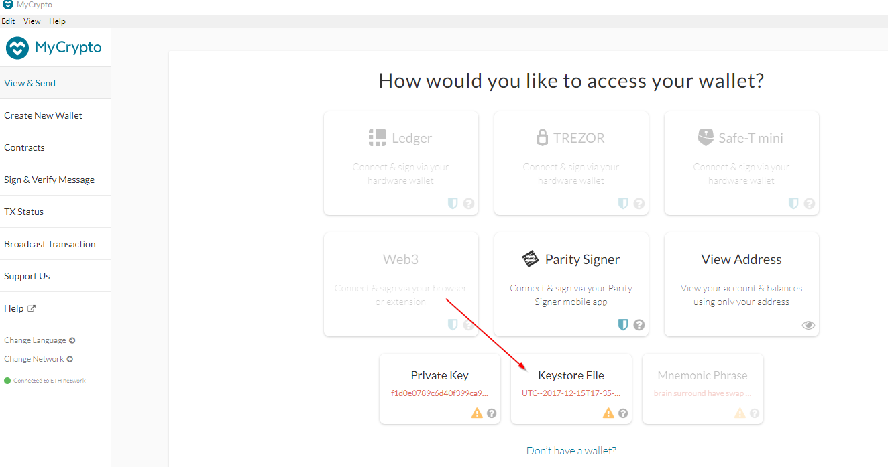

    * On the next screen, click `Select Wallet File`, then navigate to the keystore directory inside your Node1 directory, select the file located there, provide your password for `zbanknode1` when prompted and then click `Unlock`.
        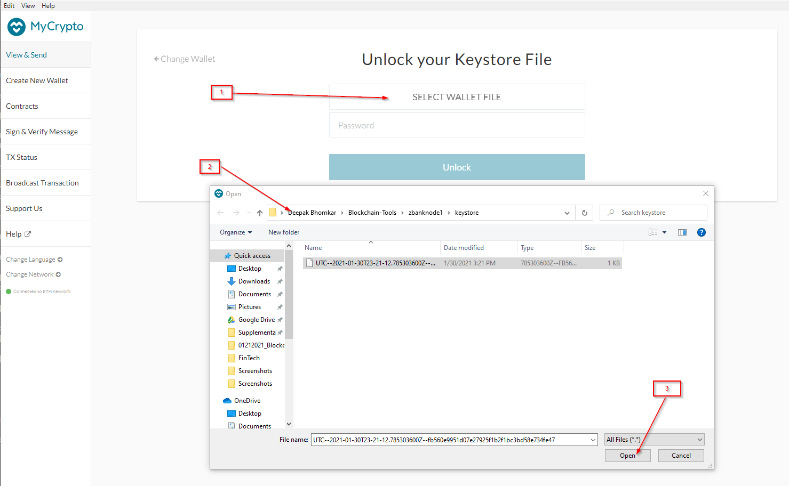
        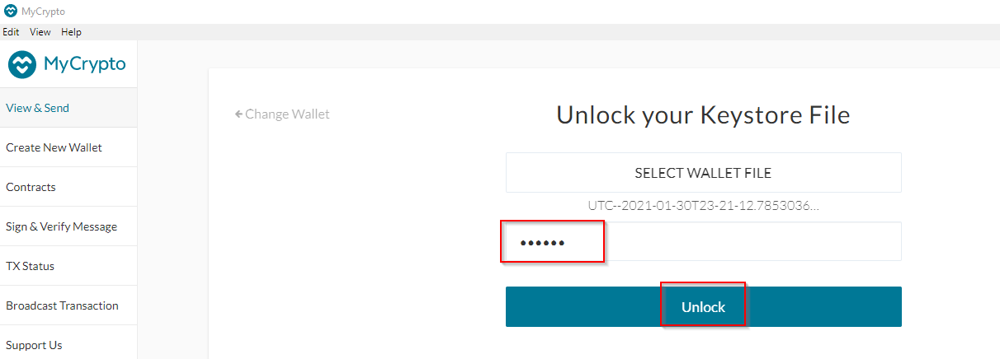

    * This will open your account wallet inside MyCrypto. This is the balance that was pre-funded for this account in the genesis configuration.   

        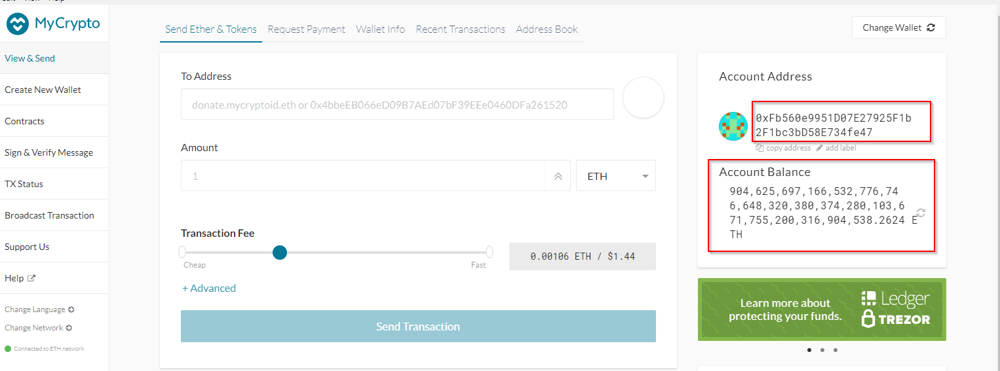

    * In the `To Address` box, type the account address from `zbanknode2`, then fill in an arbitrary amount of ETH:

    * Confirm the transaction by clicking "Send Transaction", and the "Send" button in the pop-up window.  

        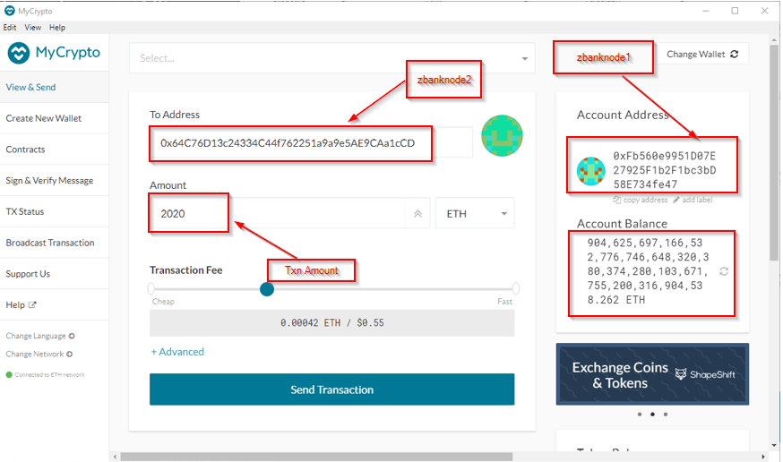 

        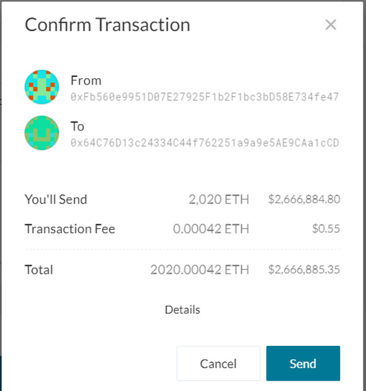  

    * Click the `Check TX Status` when the green message pops up, confirm the logout:   

            

    * You should see the transaction go from `Pending` to `Successful` after the validation is confirmed in the genesis.   

    * You can click the `Check TX Status` button to update the status.

        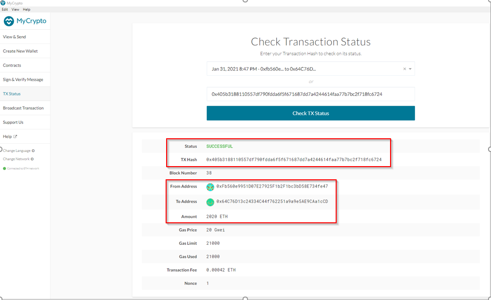

**Congratulations!! you successfully transacted in your private blockchain `zbank`**